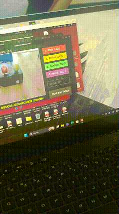
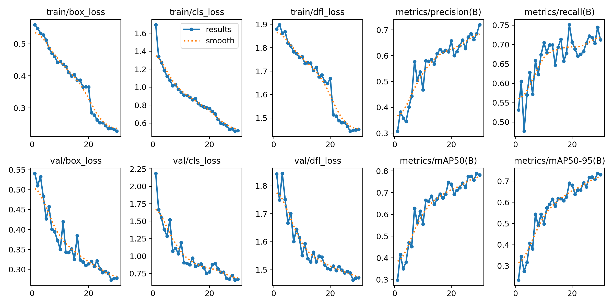
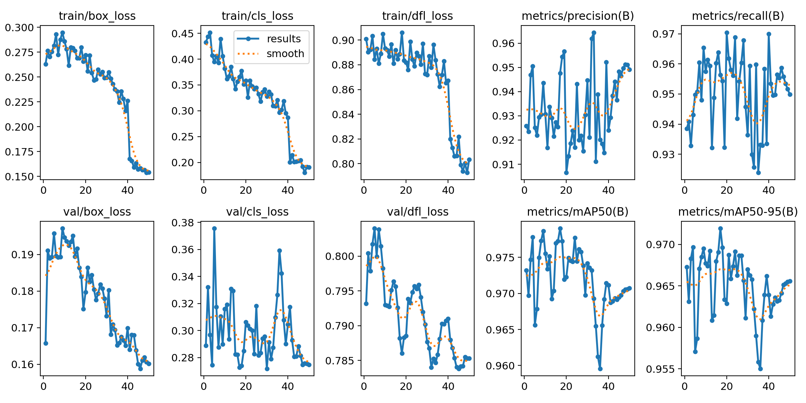
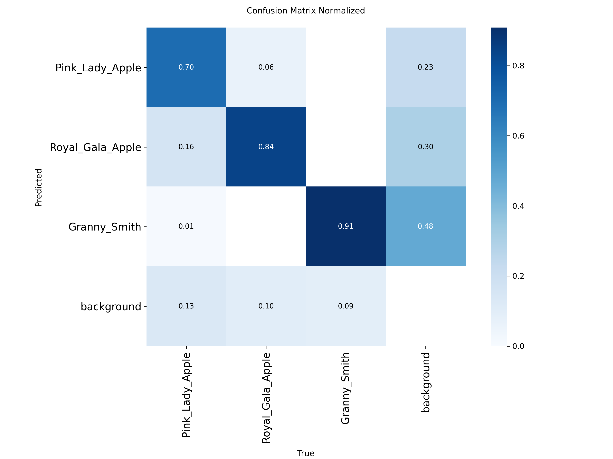
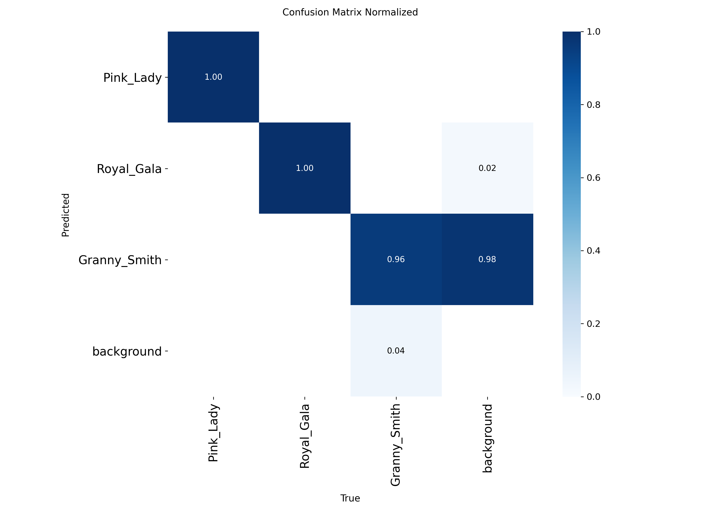
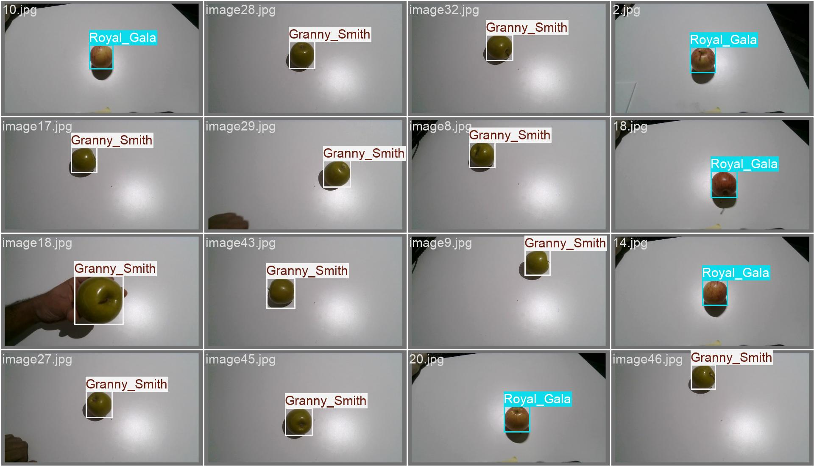
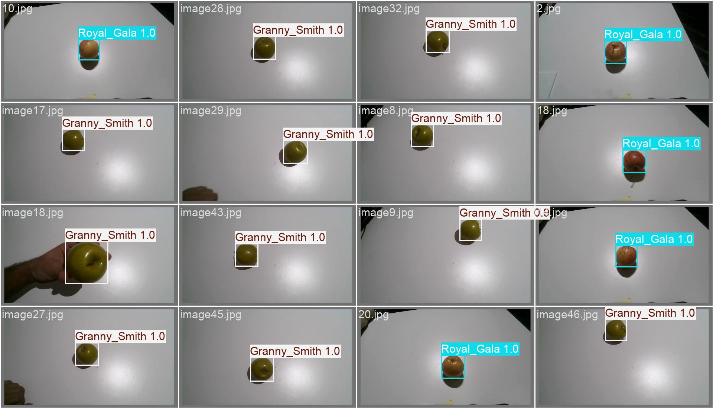

# FPR — Fruit Picking Robot
### JetRover Vision System for Autonomous Apple Harvesting
### 基于 JetRover 的自主苹果采摘视觉系统

> Macquarie University Master of Information Technology (Applied AI) — Capstone / Graduation Project
> 信息技术硕士（应用人工智能方向）— 毕业设计项目


[](https://docs.ros.org/en/humble/)
[](https://github.com/ultralytics/ultralytics)
[](https://developer.nvidia.com/tensorrt)
[](https://www.python.org/)
[]()

---

## 1. Project Overview | 项目简介

**EN:** This repository implements a vision-guided fruit picking robot based on the **JetRover platform + ROS 2 + Orbbec RGB-D camera + 6-DOF robotic arm**. The system detects three apple cultivars, estimates 3D position with depth + Kalman filtering, drives the mobile base into a graspable "sweet zone", solves Inverse Kinematics (IK), and executes a grasp–lift–return–release sequence through an interactive HUD.

**中文：** 本项目基于 **JetRover 移动底盘 + ROS 2 + Orbbec RGB-D 深度相机 + 六自由度机械臂**，实现视觉引导的苹果采摘机器人。系统可识别 3 种苹果，融合深度图与卡尔曼滤波估计 3D 位置，控制底盘进入可抓取“Sweet Zone”，求解逆运动学（IK），并通过交互式 HUD 执行“下探—夹取—托举—放回—松开—收拢”采摘流程。

**Target cultivars / 目标品种 (class id → name):**

| ID | EN | 中文 | Color cue |
|----|----|------|-----------|
| 0 | Pink Lady | 粉红佳人 | pink-red, minimal yellow |
| 1 | Royal Gala | 皇家嘎啦 | red/orange + yellow patches |
| 2 | Granny Smith | 青苹果 | solid green |

---

## 2. Key Features | 核心亮点

**EN:**
- **Lightweight detection:** YOLOv8n pruned 30% → `FP16 TensorRT .engine` for real-time inference on Jetson.
- **Two-stage visual servoing:** `First Look` (chassis approach) → `Yaw Align` → `Second Look` (precise arm strike).
- **Robust 3D localization:** median depth + nonlinear depth-drift compensation + edge-distortion compensation + 6-state Kalman Filter (`[x,y,z,vx,vy,vz]`).
- **Color verification:** Simplest Color Balance + CLAHE + HSV + RGB-ratio check to separate Pink Lady vs. Royal Gala.
- **Depth Assist Shield:** optional depth-contour fallback (150–400 mm) when YOLO is uncertain/occluded.
- **Interactive HUD:** mouse-click buttons + keyboard hotkeys (`1/2/3/4/5/6/C/H`), live FPS, mission status.
- **Full data toolchain:** AI-assisted annotator → dataset splitter → TensorRT exporter.

**中文：**
- **轻量化检测：** YOLOv8n 剪枝 30%，导出 FP16 TensorRT 引擎，适配 Jetson 端侧实时推理。
- **两阶段视觉伺服：** `初瞄`（底盘靠近）→ `偏航对准` → `精瞄`（机械臂出击）。
- **鲁棒 3D 定位：** 深度中值 + 非线性漂移补偿 + 边缘畸变补偿 + 六维卡尔曼滤波。
- **颜色二次校验：** SimplestCB + CLAHE + HSV + RGB 比例，区分易混淆的 Pink Lady / Royal Gala。
- **深度护盾：** 可选深度轮廓兜底（150–400mm），遮挡/YOLO失效时接管。
- **交互式 HUD：** 鼠标点选 + 快捷键，双语状态显示，实时 FPS。
- **全链路数据工具：** AI 辅助标注 → 数据集划分 → TensorRT 导出。

---

## 3. System Architecture | 系统架构

```
Orbbec RGB-D (/depth_cam/rgb + /depth_cam/depth)
        │  BEST_EFFORT QoS, lazy-decode (lightning cache)
        ▼
YOLOv8n-Pruned-30% TensorRT Engine (conf ≥ 0.50)
        │  + Color Verification (SimplestCB/CLAHE/HSV)
        ▼
parse_coordinates() → Depth median → Drift/Edge compensation → Kalman Filter
        ▼
FSM State Machine:
  INIT_HOME → IDLE_SEARCH (move chassis to 0.22–0.25m sweet zone)
            → YAW_ALIGN (IK safe pose, lock yaw)
            → SNAP_WAIT (second look, re-estimate)
            → FINAL_STRIKE (IK 45°, blind strike thread)
            → HUMAN_CONFIRM (click to next mission)
        ▼
/servo_controller (ServosPosition) + /cmd_vel (Twist)
```

**FSM states / 状态机:**

| State | EN description | 中文说明 |
|-------|----------------|----------|
| `INIT_HOME` | Move arm to ready pose | 回到待命位 |
| `IDLE_SEARCH` | Search target, approach with chassis | 搜索目标，底盘靠近 |
| `YAW_ALIGN` | Solve IK safe pose, lock base yaw | IK 求安全位，锁定偏航 |
| `SNAP_WAIT` | Settle 1.5s, second observation | 等待稳定，二次观测 |
| `FINAL_STRIKE` | 45° dive → grasp → lift → put-back → release → retract | 45°下探→夹取→托举→放回→松开→收拢 |
| `HUMAN_CONFIRM` | Operator confirms, advance mission queue | 人工确认，进入下一个任务 |

---

## 4. Repository Structure | 目录结构

```
.
├── FPR.py                        # Main ROS2 visual-servoing node (HUD + FSM + IK) 主程序
├── FPR_kalman.py                 # Variant with explicit Kalman emphasis 卡尔曼版本
├── export_trt.py                 # YOLO .pt → TensorRT .engine (FP16) 导出脚本
├── split_dataset.py              # Raw dataset → YOLO train/val + yaml 划分脚本
├── annotator-pro.py              # Lightweight YOLO box QA tool 轻量标注质检
├── annotator-proplus.py          # Full studio: draw/track/AI pre-label/CSRT/KCF 全功能标注
├── yolov8n_pruned_30percent.pt   # Pruned training weights 剪枝训练权重
├── yolov8n_pruned_30percent.onnx # Intermediate ONNX 中间格式
├── yolov8n_pruned_30percent.engine # Jetson TensorRT FP16 engine 加速引擎
├── yolov8n.pt                    # Base / AI-annotator weights 基础权重
└── Result/                       # Training curves, confusion matrix, val predictions
    ├── results_original.png vs results_30percentpruned+selecteddata.png
    ├── confusion_matrix_normalized_*.png
    └── val_batch0_*.jpg
```

---

## 5. Hardware & Software | 软硬件环境

**Hardware / 硬件:**
- JetRover mobile base (differential drive, `/cmd_vel`)
- Jetson onboard computer (Ubuntu + JetPack, TensorRT)
- Orbbec depth camera (`/depth_cam/rgb/image_raw`, `/depth_cam/depth/image_raw`)
- 6-DOF arm + gripper: servos `1–5` (arm), `10` (gripper, 50=open, 680=closed)

**Software / 软件:**
- Ubuntu 22.04 + ROS 2 Humble
- Python 3.10, OpenCV (`cv2.KalmanFilter`), NumPy
- `ultralytics`, `torch` (Jetson build), TensorRT
- Workspace kinematics: `/home/ubuntu/ros2_ws/src/driver/kinematics/` (`transform.angle2pulse`, `get_ik`)

Camera intrinsics (in code, recalibrate for your camera / 请按实际标定修改):
`fx=fy=358.89, cx=319.22, cy=178.91`, offsets `x=0.01, y=0.02, z=0.16`, sweet zone `0.22–0.25 m`.

---

## 6. Quick Start | 快速开始

### 6.1 Install / 安装

```bash
# ROS 2 Humble + JetPack + TensorRT pre-installed on Jetson
pip install ultralytics opencv-python numpy pyyaml

# Clone
git clone https://github.com/Getmorepower/FPR--Fruit-Picking-Robot.git
cd FPR--Fruit-Picking-Robot
```

### 6.2 Export TensorRT engine (on Jetson) / 导出加速引擎

```bash
python3 export_trt.py
# Input: yolov8n_pruned_30percent.pt
# Output: yolov8n_pruned_30percent.engine (FP16, workspace=2GB)
```

> `export_trt.py` mocks `matplotlib` to avoid NumPy 2.0 conflicts on Jetson. 在 Jetson 上通过伪造 matplotlib 绕过 NumPy 2.0 冲突。

### 6.3 Run the picking node / 运行采摘主程序

```bash
# Terminal 1: camera + base + arm drivers
ros2 launch <your_bringup> jetrover_bringup.launch.py

# Terminal 2: vision servoing
python3 FPR.py
# or Kalman-tuned variant / 卡尔曼调参版本:
# python3 FPR_kalman.py
```

The node subscribes `/depth_cam/rgb/image_raw`, `/depth_cam/depth/image_raw`, publishes `/servo_controller`, `/cmd_vel`, `/apple_vision/debug_image`.

### 6.4 Operate HUD / 操作面板

| Input | Action / 功能 |
|-------|---------------|
| Click / `1` | Mission: Pink Lady 粉红佳人 |
| Click / `2` | Mission: Royal Gala 皇家嘎啦 |
| Click / `3` | Mission: Granny Smith 青苹果 |
| Click / `4` | Ultimate: Gala → Granny → Pink Lady 三连采 |
| Click / `5` | Toggle Depth Shield 深度护盾开关 |
| Click / `6` | Confirm Taken 确认已取果，下一个 |
| `C` | Toggle chassis enable 底盘使能（默认锁死，安全） |
| `H` | Toggle hotkey help 快捷键帮助 |

> Safety: `chassis_enabled=False` by default. Set `True` (press `C`) only in open test area. 默认锁死底盘，仅在空旷场地按 `C` 解锁。

---

## 7. Dataset & Training Pipeline | 数据与训练流程

**EN:**
1. Collect raw images per cultivar into `datasets/raw_images/<Cultivar>/`.
2. Annotate with `annotator-proplus.py` (AI pre-label `M`, cross-frame track `T`, undo `Z`, copy `C`), QA with `annotator-pro.py`.
3. Split with `split_dataset.py` → `datasets/real_apple_yolo_dataset/{images,labels}/{train,val}` (80/20) + `real_dataset.yaml`.
4. Train YOLOv8n → prune 30% → fine-tune → export via `export_trt.py`.

**中文：**
1. 按品种采集原图至 `datasets/raw_images/<品种>/`；
2. 用 `annotator-proplus.py` 标注（`M`一键AI预标注，`T`跨帧追踪，`Z`撤销，`C`复制上一张），`annotator-pro.py` 质检删框；
3. 运行 `split_dataset.py` 自动 8:2 划分并生成 `real_dataset.yaml`；
4. 训练 YOLOv8n → 剪枝 30% → 微调 → `export_trt.py` 导出引擎。

```bash
python3 annotator-proplus.py -d datasets/raw_images/Granny_Smith -p image_
python3 split_dataset.py
# train with ultralytics, then:
python3 export_trt.py
```

---

## 8. Results | 实验结果

Training comparison figures are in `Result/` — original vs. 30%-pruned + selected data:

- original / 30%-pruned + selected data — loss / mAP curves
- original — 30%-pruned + selected data  per-cultivar confusion
- 30%-pruned + selected data-Labels vs 30%-pruned + selected data-Pred — qualitative predictions

**EN:** The pruned model retains competitive accuracy while significantly reducing parameters and Jetson latency (see curves). Depth compensation + Kalman filtering visibly stabilizes grasp-point jitter in live trials.

**中文：** 剪枝 30% 后模型在保持精度的同时显著降低参数量与 Jetson 推理延迟（见曲线对比）；深度补偿 + 卡尔曼滤波在实机抓取中明显抑制目标点抖动。

> Tip for thesis: paste the two `results_*.png` and confusion matrices side-by-side in your dissertation Ch.4, and cite `val_batch0_pred` as qualitative evidence. 建议论文第四章并排贴出两组曲线与混淆矩阵，并引用预测样例图作定性分析。

---

## 9. Key Parameters (tunable) | 关键可调参数

| Location | Param | Default | Note |
|----------|-------|---------|------|
| `FPR.py` | `confidence_threshold` | 0.50 | YOLO 置信度阈值 |
| `FPR.py` | `sweet_zone_min/max` | 0.22 / 0.25 m | 底盘抓取甜区 |
| `FPR.py` | `offset_x/y/z` | 0.01 / 0.02 / 0.16 | 相机→臂末端标定偏移 |
| `TargetKalmanFilter` | `processNoiseCov / measurementNoiseCov` | 1e-4 / 1e-3 | 针对 2–5mm 深度噪声 |
| `execute_blind_strike` | durations | 3.0 / 1.5 / 2.0 s | 下探/夹取/回收时长 |
| Servo 10 | open / closed | 50 / 680 pulse | 爪子开合脉冲 |

---

## 10. Limitations & Future Work | 局限与展望

**EN:**
- Single-fruit, human-confirmed loop; no multi-fruit task planning or ripeness estimation.
- Depth accuracy degrades under strong sunlight / specular highlights; AWB lock + color balance only partially mitigate.
- Fixed 45° grasp pitch; no 6D pose estimation or slip detection.
- Future: ByteTrack/DeepSORT tracking, ripeness + defect grading, MoveIt2 grasp planning, field trials with lighting dome.

**中文：**
- 当前为单果 + 人工确认闭环，尚无多果任务规划与成熟度判定；
- 强光 / 高光下深度误差增大，AWB 锁定与色彩均衡只能部分缓解；
- 抓取俯仰角固定 45°，无 6D 位姿估计与滑觉反馈；
- 未来：引入多目标追踪、成熟度/瑕疵分级、MoveIt2 抓取规划、田间大光照试验。

---

## 11. Author & Acknowledgement | 作者与致谢

- Author: Muxin Qiao — Macquarie University Master of IT (Applied AI), Capstone Project
- Supervisor: Dr. Xiaohan Yu — Macquarie University
- Platform: JetRover + ROS 2 community, Ultralytics YOLOv8, Orbbec SDK, OpenCV

> Academic use only. Datasets contain orchard-captured images; respect orchard privacy and do not redistribute raw images without permission. 仅供学术研究，果园原始图像未经许可请勿二次分发。

---

## License

MIT License (code) — model weights and datasets retain their original licenses. See `LICENSE` if added.
